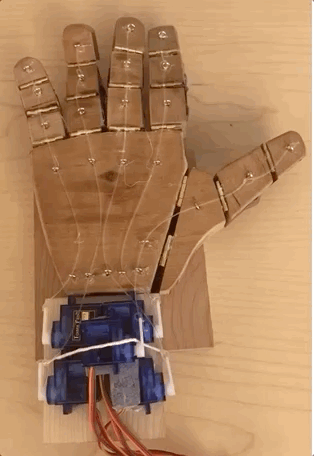
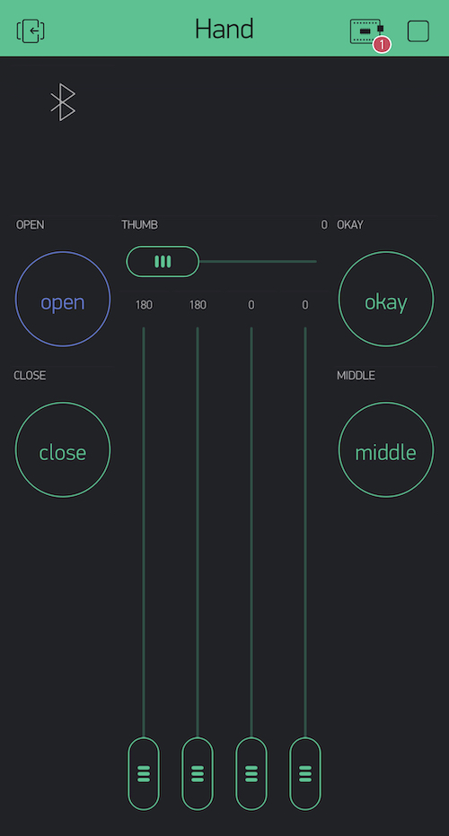

# Mechanical Hand

## Overview
A program to control the fingers of a mechanical hand from an iPhone. Allows for manual control of each finger individually as well as execution of predefined gestures. 

### Manual Control

### Gesture Control
👌("okay" button)
 

### Control UI

## Technical Descriptions

### Communications
The code runs on an ESP32 microcontroller, which is bluetooth enabled. Using the Blynk framework, the outputs of the board can be controlled using an app. 

### Program Design
A single `.ino` file is responsible for running the program, establishing the bluetooth connections, and relaying information from the UI to the hardware. 

The `Gesture` class is simply a wrapper for the intended positions of each of the five servos for a given gesture.

The `Hand` class is a wrapper for the servo objects. It contains `performGesture()` which takes a `Gesture` object and moves the fingers accordingly. 

### Electronics
The five servos are connected to PWM pins of the microcontroller. Because of the number of motors and resistance from the fingers/rubber bands, the servos had to be powered by an external supply, rather than from the board itself.

### Mechanics
By @sophia-hubscher.

Each finger consists of three hinged segments (see above) with a taut rubber band running along the backside and a fishing line on the palm side.  
When the servos pull the fishing line, the fingers contract; when the servos return, the fingers are pulled back by the rubber bands. 

### Project Dependencies
[ESP32 Arduino Core](https://dl.espressif.com/dl/package_esp32_index.json)
 [ESP32Servo Library](https://github.com/jkb-git/ESP32Servo)
 [Blynk Framework](https://github.com/blynkkk/blynk-library/releases/tag/v0.6.1)

### Project Resources
[NodeMCU-32S Pinout](https://github.com/thehookup/ESP32_Ceiling_Light/blob/master/PinModes_ESP32_NodeMCU.jpg)
 [Troubleshooting Guide](https://randomnerdtutorials.com/esp32-troubleshooting-guide/)